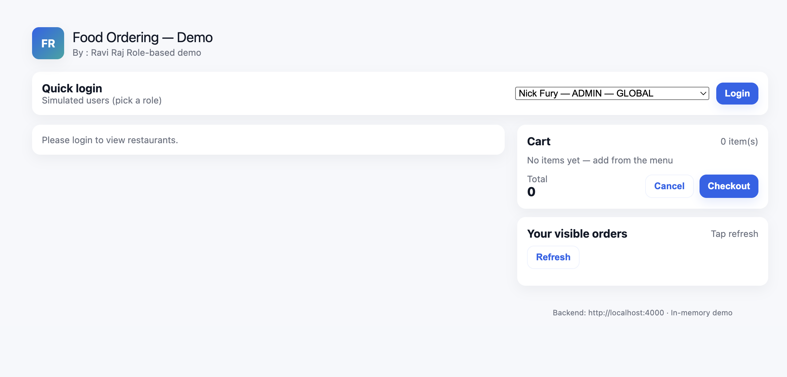

# FoodOrdering-App-Demo
_**Author: Ravi Raj**_

This project implements a simplified food ordering platform with role-based access control (RBAC) and country-scoped permissions as described in the assignment. The application is built using a lightweight full-stack setup (Node.js/Express backend + React frontend) to keep the code easy to read and straightforward to review.

## Features Implemented
### Core
- View restaurants and their menus
- Create an order (cart → items → total)
- Checkout and simulate payment
- Cancel an order
- Update user payment methods

### Role-Based Access Control
- Admin: Full access to all actions
- Manager: Can create, pay for, and cancel orders within their country
- Member: Can browse and create orders, but cannot pay or cancel

**Bonus Requirement**

**_Managers and Members only see restaurants and orders in their own country._**

## Tech Stack

**Backend:**
- Node.js
- Express
- In-memory data store for simplicity
- Simulated authentication via custom header (x-user-id)

**Frontend:**
- React (Create React App structure)
- Simple stateful UI with no external UI libraries

## How to Run

**1. Backend:**
```
cd backend
npm install
npm start
```
**_Runs on: http://localhost:4000_**

**2. Frontend:**
```
cd frontend
npm install
npm start
```
**_Runs on: http://localhost:3000_**

## Test Users
The app uses seeded users that reflect the assignment’s roles and countries.
Select any user from the login dropdown in the UI to test different permission levels.

## Project Structure
```
backend/
  server.js
  utils.js
  package.json

frontend/
  public/
    index.html
  src/
    App.js
    index.js
    style.css
  package.json
```
## Notes*
- Data is intentionally stored in memory to keep the project easy to evaluate.

- Checkout simulates payment using the signed-in user’s stored payment method.

- Country and role restrictions are enforced on the backend through middleware and route guards.

- The frontend is intentionally minimal so reviewers can quickly verify flows.

# Screenshots

1. Home Screen

    


2. Restaurant List

Users see only the restaurants they’re allowed to access (country-scoped for managers and members).


3. Menu View

Displays menu items for the selected restaurant, along with “Add to Cart” actions.


4. Cart & Order Creation

Users can review items, remove items, and create orders.


5. Order Checkout (Admin/Manager Only)

Checkout flow demonstrating payment simulation with saved payment methods.


6. Order List

Shows only the orders allowed for the logged-in user (country-scoped for non-admins).


7. Update Payment Method (Admin Only)

Admin functionality to update stored payment methods for a user.

